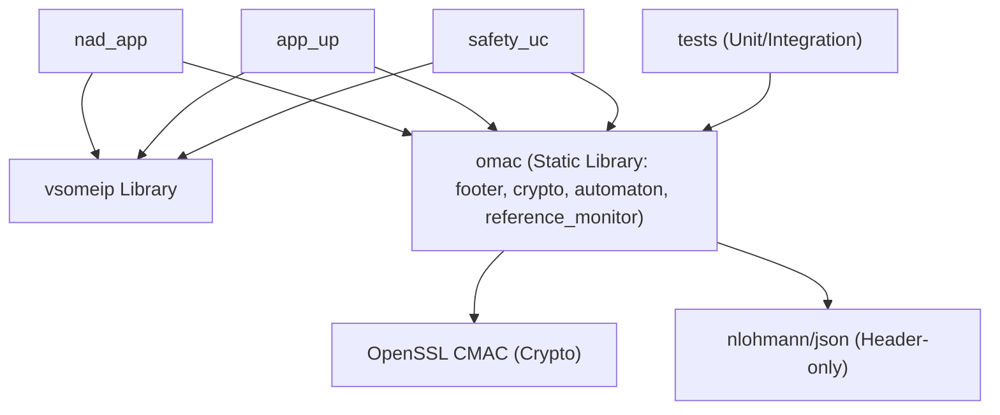

# Design Plan: oMac-vsomeip (Simplified MVP)

This document outlines the simplified, highly readable Minimum Viable Product (MVP) design for `oMac-vsomeip`, focused on demonstrating state-aware access control using a backward-compatible message footer.

---

## 1. Architectural Simplifications

We have stripped away about 70% of the enterprise-level boilerplate to maximize focus on the core security thesis:

- **No Abstract Interfaces or Factories:** Removed `ICryptoService`, `IVerifier`, and `ILogger`. Logic is implemented concretely.
- **No String Interning or Policy Compiler:** The automaton handles standard `std::string` transitions directly, rather than compiling them down to `uint32_t` IDs.
- **No SecuredMessage Wrapper:** Serialization/deserialization logic is handled via standalone utility functions that manipulate the end of a message payload buffer.
- **Flatter Directory Structure:** Files are consolidated directly under `include/` and `src/` rather than deeply nested subfolders.

---

## 2. Core Architecture

The simplified codebase tracks four distinct pieces of logic:

### Component A: The Footer (Data Layout)
A packed struct representing the metadata and cryptographic tag appended to the end of every SOME/IP message. Legacy nodes read the payload and ignore these extra trailing bytes.

- **Header:** [footer.hpp](file:///C:/Users/user/Desktop/test/0_my_repo/oMac-vsomeip/include/footer.hpp)

```cpp
#pragma pack(push, 1)
struct OMacFooter {
    uint32_t magic = 0x4F4D4143; // "OMAC"
    uint16_t domain_id;
    uint16_t method_id;
    uint8_t  mac[16];            // AES-128 CMAC tag
};
#pragma pack(pop)
```

---

### Component B: Standalone Crypto Utilities
A simple utility namespace that handles OpenSSL CMAC operations using a shared/configured key.

- **Header:** [crypto.hpp](file:///C:/Users/user/Desktop/test/0_my_repo/oMac-vsomeip/include/crypto.hpp)
- **Source:** [crypto.cpp](file:///C:/Users/user/Desktop/test/0_my_repo/oMac-vsomeip/src/crypto.cpp)

```cpp
namespace crypto {
    // Computes CMAC over the payload + footer metadata, then writes it to footer.mac
    void sign_message(const uint8_t* payload, size_t payload_len, OMacFooter& footer);
    bool verify_message(const uint8_t* payload, size_t payload_len, const OMacFooter& footer);
}
```

---

### Component C: The String-Based Automaton
A straightforward state machine mapping string transitions directly, parsing the JSON configuration rules directly.

- **Header:** [automaton.hpp](file:///C:/Users/user/Desktop/test/0_my_repo/oMac-vsomeip/include/automaton.hpp)
- **Source:** [automaton.cpp](file:///C:/Users/user/Desktop/test/0_my_repo/oMac-vsomeip/src/automaton.cpp)

```cpp
class SimpleAutomaton {
public:
    std::string current_state = "INIT";
    bool default_action = false;

    // Transition schema: [current_state][message_key] -> next_state
    // message_key is generated from: "from_component::to_component::method"
    std::unordered_map<std::string, std::unordered_map<std::string, std::string>> transitions;

    void load_from_json(const std::string& filepath);
    bool process_event(const std::string& msg_key);
};
```

---

### Component D: The Reference Monitor
Interceptors inside the communication routing path that retrieve the [OMacFooter](file:///C:/Users/user/Desktop/test/0_my_repo/oMac-vsomeip/include/footer.hpp) from the tail of the message payload buffer, verify the cryptographic signature via OpenSSL, match the identities, and step the state machine.

- **Header:** [reference_monitor.hpp](file:///C:/Users/user/Desktop/test/0_my_repo/oMac-vsomeip/include/reference_monitor.hpp)
- **Source:** [reference_monitor.cpp](file:///C:/Users/user/Desktop/test/0_my_repo/oMac-vsomeip/src/reference_monitor.cpp)

```cpp
class ReferenceMonitor {
public:
    explicit ReferenceMonitor(const std::string& policy_filepath);

    // Validates payload footer presence, CMAC authenticity, and policy transition
    bool check(const std::vector<uint8_t>& payload_buf,
               const std::string&          from_name,
               const std::string&          to_name,
               const std::string&          method_name);

    void reset();
    std::string current_state() const;

private:
    SimpleAutomaton automaton_;
    std::mutex      mutex_;
};
```

#### Distributed State Synchronization
Because each process (e.g. `app_up` vs `safety_uc`) runs its own reference monitor instance, state machines are naturally isolated. Since the protected server only receives forwarded calls and never witnesses client-to-broker handshake messages, a naive sequence check would fail. 

To solve this, the monitor implements a secure **State Synchronization** mechanism:
- **Client Nodes (starting with "NAD"):** The monitor strictly validates the sequence against the current local state.
- **Broker Nodes (not starting with "NAD"):** The receiver validates the CMAC. If authentic, it trusts that the broker's reference monitor verified the sequence and automatically synchronizes its local state machine to match the expected state of the transition, allowing the call.

---

## 3. Simplified File Structure

```
omac-vsomeip/
├── CMakeLists.txt
├── README.md
├── .gitignore
├── Design_Plan.md
│
├── third_party/
│   ├── vsomeip/                        # git submodule (don't modify)
│   └── nlohmann/json.hpp               # header-only JSON library
│
├── include/
│   ├── footer.hpp                      # OMacFooter struct
│   ├── crypto.hpp                      # sign/verify functions
│   ├── automaton.hpp                   # SimpleAutomaton class
│   └── reference_monitor.hpp           # ReferenceMonitor class
│
├── src/
│   ├── crypto.cpp                      # OpenSSL CMAC implementation
│   ├── automaton.cpp                   # JSON loading and transition logic
│   └── reference_monitor.cpp           # payload interception and validation
│
├── policies/
│   ├── tcu_rd_rc_policy.json           # TCU policy file
│   └── schema/
│       └── policy_schema.json          # validation schema
│
├── examples/
│   ├── CMakeLists.txt
│   ├── nad_app.cpp                     # legitimates & attackers simulation
│   ├── app_up.cpp                      # broker broker simulation
│   └── safety_uc.cpp                   # protected endpoint simulation
│
└── tests/
    ├── CMakeLists.txt
    ├── test_footer.cpp                 # footer serialization / size tests
    ├── test_crypto.cpp                 # CMAC signature round-trip verification
    ├── test_automaton.cpp              # string state transitions & policy loading
    └── test_flows.cpp                  # integration checks for flows F1-F4
```

---

## 4. Build Dependency Graph



---

## 5. Streamlined 5-Step Implementation Plan

1. **Step 1: Raw Bytes & Crypto**
   Implement `footer.hpp` and `crypto.cpp`. Test serializing a payload, appending `OMacFooter` to the end of a buffer, signing it with OpenSSL AES-128 CMAC, and verifying the signature. Verify via `test_crypto.cpp` and `test_footer.cpp`.

2. **Step 2: Simple Automaton**
   Build the string-based state machine in `automaton.cpp`. Write unit tests to check state transitions, verifying correct updates and blocks.

3. **Step 3: JSON Policy Engine**
   Add JSON loading to `SimpleAutomaton` using `nlohmann/json` directly inside the class. Test with `tcu_rd_rc_policy.json` to verify parsing and loaded transition maps.

4. **Step 4: Connect to vsomeip & Reference Monitor**
   Write the `ReferenceMonitor` payload interception logic. Incorporate `vsomeip` buffer retrieval, resizing, footer extraction/writing, and verification.

5. **Step 5: The Integration Demo & Flows**
   Implement `nad_app.cpp`, `app_up.cpp`, and `safety_uc.cpp`. Create and run `test_flows.cpp` as an automated integration test verifying passing flow F1 and dropping/blocking flows F2, F3, and F4.
