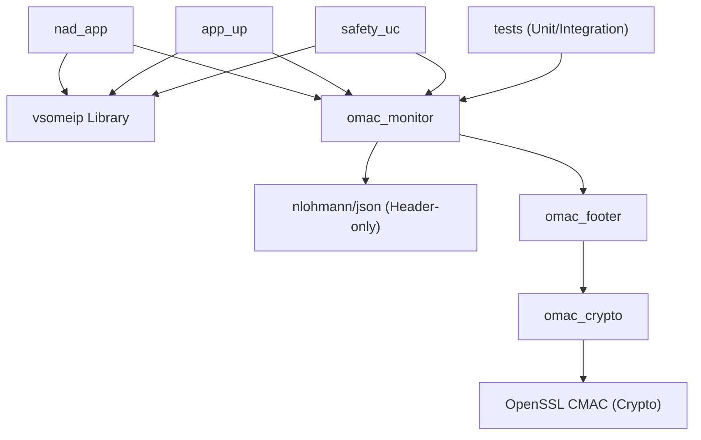

# Design Plan: oMac-vsomeip

This document outlines the architectural design, component descriptions, build dependency graph, and strict implementation order for the `oMac-vsomeip` project.

---

## Component Specifications

### 1. Footer and Secured Message (`include/` + `src/footer/`)

#### [secured_footer.hpp](file:///C:/Users/user/Desktop/test/0_my_repo/oMac-vsomeip/include/footer/secured_footer.hpp)
Defines the pure data structure for the 24-byte secured footer. This structure contains no behavior/logic.
```cpp
// The exact 24-byte layout appended to every SOME/IP message
struct SecuredFooter {
    uint16_t  calling_method_id;   // Which method triggered this call
    uint16_t  domain_id;           // Sender's functional domain
    uint8_t   maco[16];            // CMAC authentication code
    uint32_t  magic;               // Sentinel value to detect footer presence
    // Total = 2 + 2 + 16 + 4 = 24 bytes
};
```

#### [message_secured.hpp](file:///C:/Users/user/Desktop/test/0_my_repo/oMac-vsomeip/include/footer/message_secured.hpp)
Declares the `MessageSecured` class inheriting from `vsomeip::message_base_impl`.
```cpp
class MessageSecured : public vsomeip::message_base_impl {
public:
    void set_calling_method(uint16_t method_id);
    void set_domain(uint16_t domain_id);
    bool has_footer() const;
    const SecuredFooter& get_footer() const;

    std::shared_ptr<vsomeip::payload> serialize() const override;
    bool deserialize(const uint8_t* data, uint32_t length) override;

private:
    SecuredFooter footer_;
    void compute_maco();   // Fills footer_.maco using CMAC
};
```

#### [message_secured.cpp](file:///C:/Users/user/Desktop/test/0_my_repo/oMac-vsomeip/src/footer/message_secured.cpp)
Contains the implementation of `serialize()` and `deserialize()`, calling into `cmac.cpp` to compute and verify the `maco` tag.

---

### 2. State Machine and Reference Monitor (`include/` + `src/monitor/`)

#### [automaton.hpp](file:///C:/Users/user/Desktop/test/0_my_repo/oMac-vsomeip/include/monitor/automaton.hpp)
Defines the transitions and state machine container.
```cpp
struct Transition {
    std::string current_state;
    std::string from_component;   // e.g. "NAD::4G"
    std::string to_component;     // e.g. "AppuP::RD"
    std::string method;           // e.g. "invoke_RD"
    std::string next_state;       // e.g. "state_1"
    bool        allow;            // true=allow, false=deny
};

class Automaton {
public:
    void add_transition(const Transition& t);
    void set_initial_state(const std::string& state);
    void reset();

    // Returns true if allowed, false if blocked
    // Advances internal state if allowed
    bool process(const std::string& from,
                 const std::string& to,
                 const std::string& method);

    std::string current_state() const;

private:
    std::string current_state_;
    std::vector<Transition> transitions_;
};
```

#### [automaton.cpp](file:///C:/Users/user/Desktop/test/0_my_repo/oMac-vsomeip/src/monitor/automaton.cpp)
Implements state transition rules and checks if incoming requests are permitted based on the current state.

#### [reference_monitor.hpp](file:///C:/Users/user/Desktop/test/0_my_repo/oMac-vsomeip/include/monitor/reference_monitor.hpp)
Declares the thread-safe reference monitor that intercepts `vsomeip` messages before routing.
```cpp
class ReferenceMonitor {
public:
    explicit ReferenceMonitor(std::shared_ptr<Automaton> automaton);

    // Called on every outgoing message before it hits the network
    // Returns true = let it through, false = drop it
    bool on_message(const MessageSecured& msg);

    // Called when automaton violation occurs — log it
    void on_violation(const MessageSecured& msg);

private:
    std::shared_ptr<Automaton> automaton_;
    std::mutex mutex_;   // Thread safety — vsomeip is multi-threaded
};
```

#### [reference_monitor.cpp](file:///C:/Users/user/Desktop/test/0_my_repo/oMac-vsomeip/src/monitor/reference_monitor.cpp)
Implements interception, invocation check, state advancement, and violation logging.

#### [policy_loader.hpp](file:///C:/Users/user/Desktop/test/0_my_repo/oMac-vsomeip/include/monitor/policy_loader.hpp)
Declares helper to read JSON configuration.
```cpp
class PolicyLoader {
public:
    // Reads a JSON file and builds a ready-to-use Automaton
    static std::shared_ptr<Automaton> load(const std::string& filepath);
};
```

#### [policy_loader.cpp](file:///C:/Users/user/Desktop/test/0_my_repo/oMac-vsomeip/src/monitor/policy_loader.cpp)
Parses a JSON file using `nlohmann/json` to initialize the `Automaton`.
```cpp
std::shared_ptr<Automaton> PolicyLoader::load(const std::string& filepath) {
    std::ifstream f(filepath);
    auto j = nlohmann::json::parse(f);
    auto automaton = std::make_shared<Automaton>();
    automaton->set_initial_state(j["initial_state"]);
    for (auto& t : j["transitions"]) {
        automaton->add_transition({
            t["from_state"], t["from_component"],
            t["to_component"], t["method"],
            t["to_state"],    t["allow"]
        });
    }
    return automaton;
}
```

---

### 3. Policy Schema and Definitions (`policies/`)

#### [tcu_rd_rc_policy.json](file:///C:/Users/user/Desktop/test/0_my_repo/oMac-vsomeip/policies/tcu_rd_rc_policy.json)
Data file defining the allowed flows from the paper.
```json
{
  "name": "TCU Remote Diagnostic and Remote Control",
  "initial_state": "idle",
  "transitions": [
    {
      "from_state":      "idle",
      "from_component":  "NAD::4G",
      "to_component":    "AppuP::RD",
      "method":          "invoke_RD",
      "to_state":        "nad_called_rd",
      "allow":           true
    },
    {
      "from_state":      "nad_called_rd",
      "from_component":  "AppuP::RD",
      "to_component":    "SafetyuC::Diag",
      "method":          "invoke_Diag",
      "to_state":        "idle",
      "allow":           true
    },
    {
      "from_state":      "idle",
      "from_component":  "NAD::4G",
      "to_component":    "AppuP::RC",
      "method":          "invoke_RC",
      "to_state":        "nad_called_rc",
      "allow":           true
    },
    {
      "from_state":      "nad_called_rc",
      "from_component":  "AppuP::RC",
      "to_component":    "SafetyuC::Ctrl",
      "method":          "invoke_Ctrl",
      "to_state":        "idle",
      "allow":           true
    }
  ],
  "default": "deny"
}
```
Any execution sequence not matching one of these defined transitions is blocked.

#### [policy_schema.json](file:///C:/Users/user/Desktop/test/0_my_repo/oMac-vsomeip/policies/schema/policy_schema.json)
JSON schema file to validate policy JSON layout.

---

### 4. Examples (`examples/`)

Each example is a standalone executable linking against `vsomeip` and the `omac` library.

- [nad_app.cpp](file:///C:/Users/user/Desktop/test/0_my_repo/oMac-vsomeip/examples/nad/nad_app.cpp): Registers as a client, sending legitimate and illegitimate requests.
- [app_up.cpp](file:///C:/Users/user/Desktop/test/0_my_repo/oMac-vsomeip/examples/app_up/app_up.cpp): Acts as both a client and server, hosting the main monitoring/brokerage logic.
- [safety_uc.cpp](file:///C:/Users/user/Desktop/test/0_my_repo/oMac-vsomeip/examples/safety_uc/safety_uc.cpp): Pure server/endpoint log-sink simulating the Safety uC.

---

### 5. Tests (`tests/`)

- [test_footer.cpp](file:///C:/Users/user/Desktop/test/0_my_repo/oMac-vsomeip/tests/test_footer.cpp): Tests the footer serializing/deserializing logic.
- [test_cmac.cpp](file:///C:/Users/user/Desktop/test/0_my_repo/oMac-vsomeip/tests/test_cmac.cpp): Validates CMAC implementation against known RFC test vectors.
- [test_automaton.cpp](file:///C:/Users/user/Desktop/test/0_my_repo/oMac-vsomeip/tests/test_automaton.cpp): Verifies flow allow/block transitions directly without `vsomeip` dependencies.
- [test_flows.cpp](file:///C:/Users/user/Desktop/test/0_my_repo/oMac-vsomeip/tests/test_flows.cpp): End-to-end integration test verifying standard flows and security blocking.

---

## Build Dependency Graph



---

## Implementation Order

> [!IMPORTANT]
> The following sequence should be strictly followed to ensure clean development steps and unit-testability at each milestone.

1. **Secured Footer Setup**: Implement serialization and deserialization in `secured_footer.hpp` and `secured_footer.cpp`. Verify correctness via `test_footer.cpp`.
2. **CMAC Wrapper**: Write the CMAC cryptographic wrapper in `cmac.hpp` / `cmac.cpp` using OpenSSL. Test via `test_cmac.cpp` against RFC vectors.
3. **Integration of CMAC & Footer**: Add footer authentication logic to `message_secured.hpp` / `message_secured.cpp`.
4. **Automaton Core**: Implement `automaton.hpp` and `automaton.cpp` logic. Verify all state machine transitions (F1 passing, F2/F3/F4 blocking) using `test_automaton.cpp`.
5. **Policy Loader**: Load JSON policies in `policy_loader.hpp` / `policy_loader.cpp`. Write the corresponding schema and test files.
6. **Reference Monitor Interceptor**: Connect the `Automaton` to `ReferenceMonitor`.
7. **Examples & End-to-End Tests**: Build `nad_app`, `app_up`, and `safety_uc`, and orchestrate integration validation using `test_flows.cpp`.
