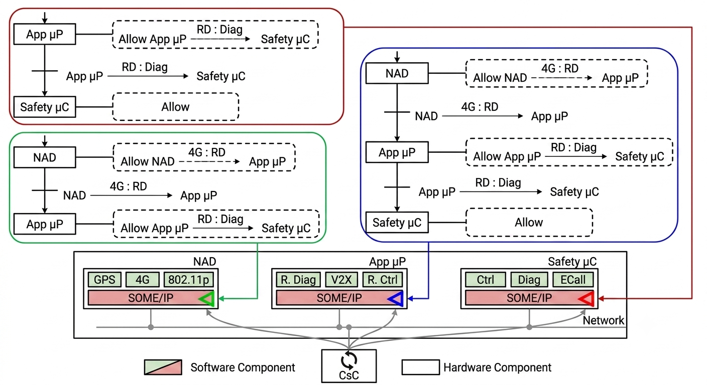
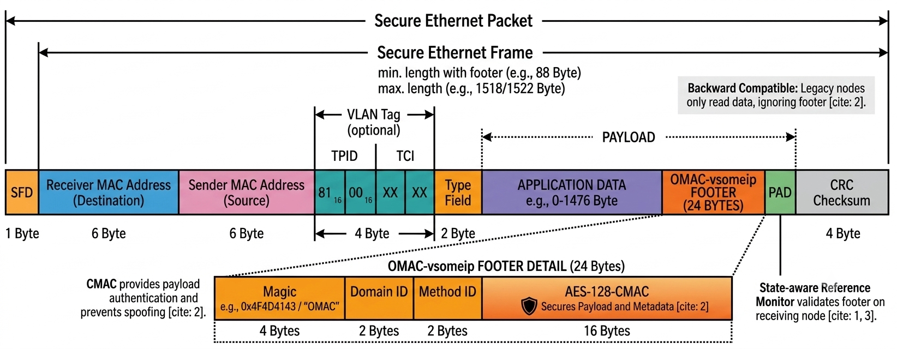
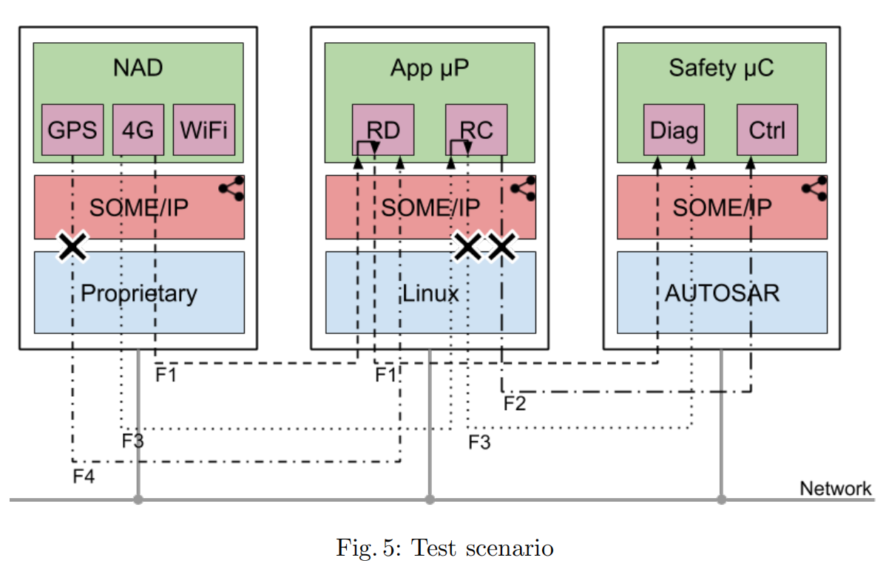

# oMac-vsomeip

A secure, backward-compatible SOME/IP reference-monitor proof of concept. This project implements the state-aware access control mechanism and cryptographic security footers described in **Section 3.2 (Implementation Requirements)** of the oMAC (Open Model for Automotive Cybersecurity) research paper.

The implementation preserves the paper's secure wire-format behavior, CMAC-based authentication, and state-automaton enforcement while maintaining build compatibility against COVESA's public `vsomeip3` APIs.

---

## Architecture Overview

To achieve fine-grained access control on automotive networks without breaking existing configurations, this repository implements a security layer based on three pillars:



1. **OMacFooter (24-byte Payload Tail):**
   A trailing footer appended directly to the end of standard SOME/IP payloads:
   - **Magic (4 bytes - `0x4F4D4143` / "OMAC"):** Detects footer presence.
   - **Domain ID (2 bytes):** Identifies the caller's functional domain (e.g., Telematic Unit vs. Safety).
   - **Method ID (2 bytes):** Identifies the calling method.
   - **AES-128-CMAC (16 bytes):** Authenticates the application payload and the metadata fields to prevent spoofing or replay.

   

2. **Backward Compatibility:**
   Because the security footer is placed at the end of payloads, legacy (un-extended) nodes on the SOME/IP network will only read the application data they expect and ignore the trailing 24 bytes, preventing protocol breakage.

3. **State-Aware Reference Monitor:**
   An active gatekeeper running on the receiving node (or an intermediate microprocessor broker) that validates the footer magic and CMAC tag, then queries a state-automaton loaded from JSON-defined security policies. If the message matches an allowed transition in the current state, the state advances and the call is allowed. If not, the call is dropped immediately.

---

## System Requirements & Dependencies

To clone, compile, and run this repository, ensure you have the following installed on your Linux (or WSL) machine:

* **C++ Compiler:** A compiler supporting C++17 (e.g., GCC 9+ or Clang).
* **CMake:** Version 3.16 or higher.
* **OpenSSL Dev Libraries:** Used for the AES-128-CMAC cryptographic calculations.
  * *Ubuntu/Debian:* `sudo apt-get install libssl-dev`
  * *CentOS/RHEL:* `sudo yum install openssl-devel`
* **Threads:** POSIX thread support (pthread) is required.
* **vsomeip3:** COVESA's open-source SOME/IP implementation.
  * If vsomeip3 is installed in a custom location, you can direct CMake to find it by specifying the variable `-Dvsomeip3_DIR=/path/to/vsomeip/build`.

---

## Portable & Robust Build System

We have designed a highly generalized and robust CMake build configuration to handle complex runtime dependencies seamlessly:

* **Automatic POSIX Threads Linking:** Example binaries are linked directly with `Threads::Threads` to resolve implicit multi-threading symbol dependencies across various Linux distros.
* **Automatic RPATH (Runpath) Configuration:** To eliminate the need for manually setting or exporting `LD_LIBRARY_PATH`, the build system automatically embeds the directory of the linked shared libraries (such as your local `vsomeip3` build directory) into the executable's search paths.
* **Compatibility with `dlopen` (`DT_RPATH`):** Under modern Linux loaders, standard `DT_RUNPATH` fails to propagate search paths to inner `dlopen()` calls (such as vsomeip dynamically loading its config module `libvsomeip3-cfg.so`). We force old-style `DT_RPATH` tags using `-Wl,--disable-new-dtags` which resolves configuration loading errors out-of-the-box.

---

## Build and Run Instructions

### 1. Configure and Build the Project

From the root of the repository:

```bash
mkdir -p build
cd build
# Optional: Set vsomeip3_DIR if it's not installed in system paths
cmake -Dvsomeip3_DIR=/home/mhamedot/vsomeip/build ..
cmake --build . -j$(nproc)
```

This compiles:
* `libomac.a` - The core static library containing the reference monitor, state automaton, and CMAC verification helpers.
* **Unit Tests:** `test_footer`, `test_crypto`, `test_automaton`, `test_flows`, and `test_inheritance`.
* **Example Applications:** `safety_uc`, `app_up`, and `nad_app`.

### 2. Execute the Automated Unit Tests

Run the full test suite from the `build/` directory:

```bash
ctest --output-on-failure
```

This tests:
* Structural packing of the `OMacFooter`.
* Cryptographic signature and verification integrity.
* JSON-based security policy loading and state automaton transitions.
* **UML Inheritance Mock Proof (`test_inheritance`):** Verifies the paper's original model where a `SecuredMessageImpl` directly inherits from standard SOME/IP message classes and hooks footers/CMAC inside middleware serialization.



### 3. Run the Multi-Process Demo

The demo models the access control scenarios from the research paper (Figure 5) representing a Remote Diagnostic (RD) sequence, Remote Control (RC) duties separation, and GPS sender isolation.

#### Option A: One-Click Run Script (Recommended)
From the root of the repository, execute the wrapper script:

```bash
./run_demo.sh
```
This script will build the binaries, verify all unit tests, launch the three processes in the background, run the scripted sequence, and cleanly print all logs.

#### Option B: Manual Multi-Terminal Run
Open 3 separate terminals, enter `build/examples/`, and execute:

* **Terminal 1: Safety Microcontroller (`safety_uc`)**
  ```bash
  VSOMEIP_CONFIGURATION=../../examples/config/vsomeip-safety.json ./safety_uc ../../policies/tcu_rd_rc_policy.json
  ```
* **Terminal 2: Application Processor Broker (`app_up`)**
  ```bash
  VSOMEIP_CONFIGURATION=../../examples/config/vsomeip-appup.json ./app_up ../../policies/tcu_rd_rc_policy.json
  ```
* **Terminal 3: Network Access Device Client (`nad_app`)**
  ```bash
  VSOMEIP_CONFIGURATION=../../examples/config/vsomeip-nad.json ./nad_app
  ```

---

## Security Policy Configuration

The reference monitor processes transitions defined in a simple JSON format. You can customize the transitions and rules in `policies/tcu_rd_rc_policy.json`:

```json
{
  "name": "TCU Remote Diagnostic and Remote Control",
  "initial_state": "idle",
  "default": "deny",
  "transitions": [
    {
      "comment":        "F1-a: NAD initiates a Remote Diagnostic session",
      "from_state":     "idle",
      "from_component": "NAD::4G",
      "to_component":   "AppuP::RD",
      "method":         "invoke_RD",
      "to_state":       "nad_called_rd",
      "allow":          true
    }
  ]
}
```
Modify this file to define custom automotive access control logic, add components, or declare state paths.

